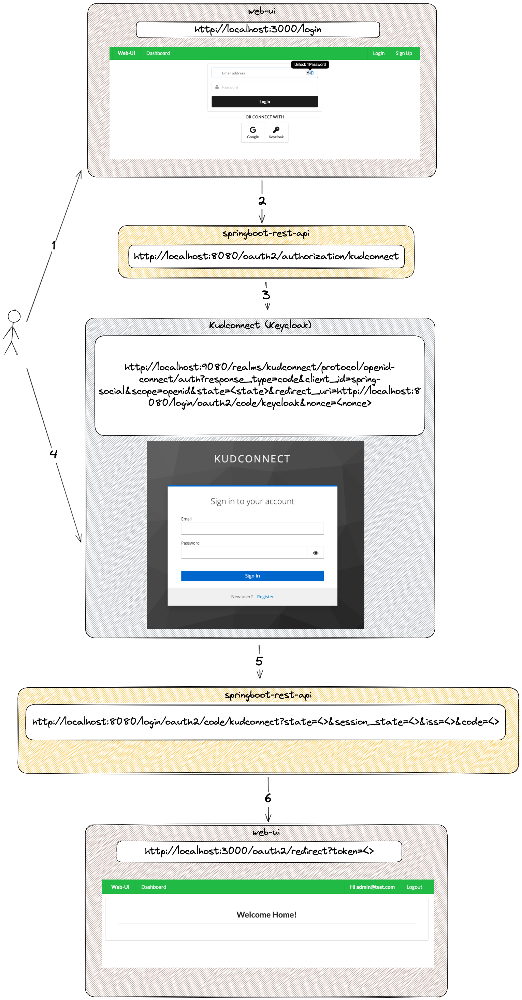

# Spring Social Login With React

This is a simple example of how to implement a login with social networks like Google, Facebook, GitHub using Spring Boot and React.
Also, this project take the opportunity to show how would you integrate a custom provider like Keycloak.

## Diagram

## Technologies
- Java 21
- Spring Boot
- React
- Keycloak

## References

https://github.com/ivangfr/springboot-react-social-login/tree/master?tab=readme-ov-file

